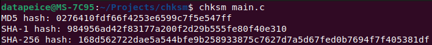

# Multi-Threaded File Hash Checker
### This project is a multi-threaded hash verification tool written in C using OpenSSL. It computes MD5, SHA-1, and SHA-256 checksums for a given file in parallel, leveraging pthreads to optimize performance.



Features:
- Supports MD5, SHA-1, and SHA-256 hash algorithms
- Multi-threaded execution for faster processing
- Uses OpenSSL for secure and reliable hashing
- Simple command-line interface

## Dependencies
 - clang
 - libssl-dev


How to install:
   ```bash
   sudo ./install.sh
   ```

How to use
  ```bash
  chksm <filename>
  ```
How to unistall:
  ```bash
  sudo ./unistall.sh
  ```

For any problems, feel free to chat with me!
